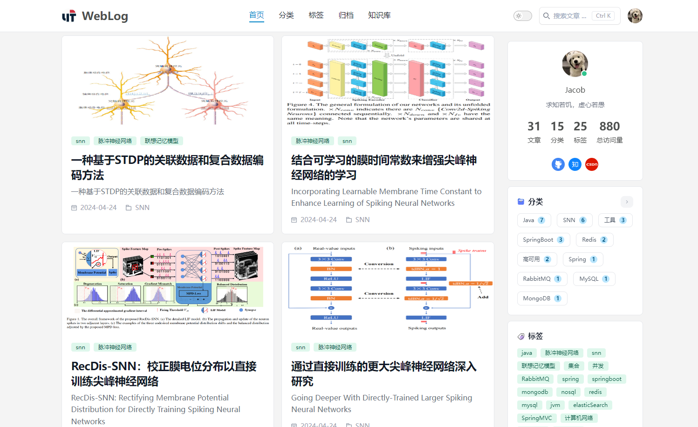
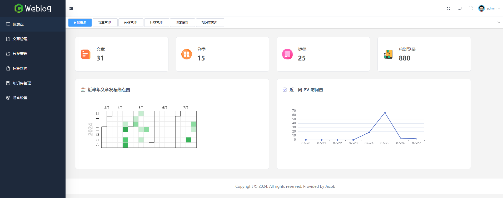
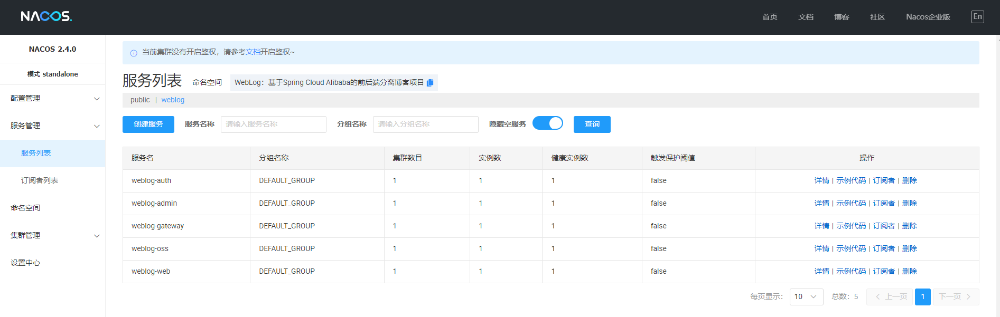

# WeBlog

## 简介

一款由 Spring Boot 3.0.2 + Spring Cloud Alibaba 2022.0.0.0 + Vue 3.2 + Vite 4.3 开发的前后端分离博客。

- 后端采用 Spring Cloud Alibaba、Spring Boot 、Mybatis Plus 、MySQL 、SaToken、Nacos、Redis、Minio、阿里云OSS 等；
- 实现系统登录认证和权限控制，结合 Redis 存储用户会话信息；
- 集成 Nacos 进行动态配置管理和服务发现，简化服务注册与治理；
- 后台管理基于 Vue 3.2 + Vite + Element Plus 纯手动搭建的管理后台，未采用任何 Admin 框架；
- 支持博客 Markdown 格式发布与编辑、文章分类、文章标签的管理；
- 支持博客基本信息的设置，以及社交主页的跳转；
- 支持仪表盘数据统计，Echarts 文章发布热图统计、PV 访问量统计；

## 相关地址

- GitHub 地址：https://github.com/jdw-art/MicroWebLog
- 演示地址：http://110.41.141.141/#/

### 后端项目模块介绍

| 模块名                                         | 说明                          |
|---------------------------------------------|-----------------------------|
| weblog-admin                                | 博客后台管理微服务                   |
| weblog-auth                                 | 权限管理微服务                     |
| weblog-oss                                  | 对象存储微服务                     |
| weblog-framework                            | 通用模块                        |
| weblog-search                               | 全文搜索模块                      |
| weblog-common                               | 通用模块                        |
| weblog-spring-boot-starter-biz-operationlog | 切面日志 Spring Boot starter    |
| weblog-spring-boot-starter-jackson          | Jackson Spring Boot starter |
| weblog-spring-boot-starter-biz-context      | 上下文参数 Spring Boot starter   |
| weblog-gateway                              | Spring Cloud 网关             |
| weblog-web                                  | 博客前台（启动入口）                  |

## 技术栈

### 后端

| 框架                   | 说明               | 版本号         | 备注                  |
|----------------------|------------------|-------------|---------------------|
| JDK                  | Java 开发工具包       | 17          | 它是目前企业项目比较主流的版本     |
| Spring Boot          | Web 应用开发框架       | 3.0.2       |                     |
| Spring Cloud Alibaba | 安全框架             | 2022.0.0.0       |                     |
| Nacos                | 微服务治理框架          | 0.3.0-RC       |                     |
| Maven                | 项目构建工具           | 3.6.3       | 企业主流的构建工具           |
| MySQL                | 数据库              | 8.0.29           |                     |
| Mybatis Plus         | Mybatis 增强版持久层框架 | 3.5.2       |                     |
| Durid                | 数据库连接池           | 1.2.23       | Durid 数据库连接池 |
| Lombok               | 消除冗余的样板式代码       | 1.8.22      |                     |
| Jackson              | JSON 工具库         | 2.13.1      |                     |
| Hibernate Validator  | 参数校验组件           | 6.2.0.Final |                     |
| Logback              | 日志组件             | 1.2.10      |                     |
| Redis                | 缓存               | 5.0.14.1        |                     |
| Sa-Token             | 微服务支持的Java权限认证框架 | 1.38.0        |                     |
| p6spy                | 动态监测框架           | 3.9.1       |                     |
| Minio                | 对象存储             | 8.2.1       | 用于存储博客中相关图片         |
| aliyunOSS            | 对象存储             | 3.17.4       | 用于存储博客中相关图片         |
| flexmark             | Markdown 解析      | 0.62.2      |                     |
| lucene               | 全文搜索引擎           | 8.11.1      |                     |

### 前端

| 框架         | 说明                            | 版本号  |
| ------------ | ------------------------------- | ------- |
| Node         | JavaScript 运行时环境           | 18.15.0 |
| Vue 3        | Javascript 渐进式框架           | 3.2.47  |
| Vite         | 前端项目构建工具                | 4.3.9   |
| Element Plus | 饿了么基于 Vue 3 开源的组件框架 | 2.3.3   |
| vue-router   | Vue 路由管理器                  | 4.1.6   |
| vuex         | 状态存储组件                    | 4.0.2   |
| md-editor-v3 | Markdown 编辑器组件             | 3.0.1   |
| windicss     | CSS 工具类框架                  | 3.5.6   |
| axios        | 基于 Promise 的网络请求库       | 1.3.5   |
| Echarts      | 百度开源的数据可视化图表库      | 5.4.2   |

## WebLog 前台

## WebLog 后台

## Nacos 服务发现和配置管理

